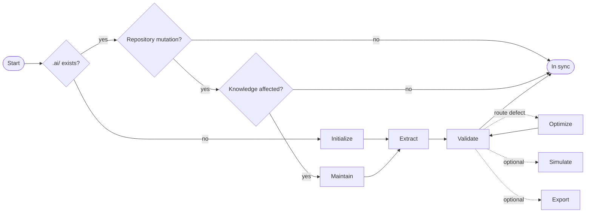

# token-atlas

Token Atlas is an AI context-optimization skill for coding agents. It extracts **verified** repository knowledge into a compact `.ai/` knowledge base, so agents load the *smallest* reliable context for each task instead of the whole repo.

- Repository source is truth; `.ai/` Markdown is canonical AI knowledge; retrieval exports are derived.
- Full maintains knowledge through an adaptive end-of-turn protocol; Lite
  updates shared knowledge inline during implementation.
- Portable: copy one folder into any repo and invoke it by name.

## Choose an edition

| Edition | Best for | Runtime behavior |
| --- | --- | --- |
| [Token Atlas](skills/token-atlas/) | Large repositories and frequent cross-capability retrieval | Complete PKF routes, authoritative leaves, adaptive retrieval, and semantic closeout |
| [Token Atlas Lite](skills/token-atlas-lite/) | Lean shared architecture, decisions, terminology, dependencies, and memory | Six Markdown knowledge files, inline updates during implementation, and no separate closeout |

Lite loads only `INDEX.md` and a memory file capped at 1,000 approximate tokens
at session start. It does not generate PKF routes, leaves, retrieval exports, or
repository-local tools. Lite and Full are separate public skills; no automatic
edition migration is provided.

## Full Token Atlas quick start

1. Copy the public skill package into your repo at your agent's skill-discovery path (for example `.agents/skills/`):

   ```bash
   cp -r skills/token-atlas <your-repo>/.agents/skills/token-atlas
   ```

   Copy only `skills/token-atlas/` (`SKILL.md`, `references/`, `agents/`, and the
   dependency-light scaffold, route, and validator helpers under `scripts/`,
   plus their templates). You do not need the repository root maintainer
   scripts, tests, or benchmark fixtures.

2. Ask your agent for the skill by name for the initial setup:

   > Use the **token-atlas** skill to initialize PKF and extract knowledge for this repo.

3. The first run inspects a bounded structural summary, reviews capability and
   symbol ownership, creates a complete source-backed `.ai/` knowledge base,
   repairs all validation findings, and seals it only after strict validation.
   It emits no TODO, pending, unknown, or placeholder leaves. Optimization runs
   only when validation finds a routing defect.
   Subsequent knowledge-impacting mutations run adaptive closeout automatically;
   read-only and knowledge-neutral turns bypass Token Atlas work.

## Token Atlas Lite quick start

1. Copy `skills/token-atlas-lite/` into the target repository's skill-discovery
   path.
2. Ask: "Use **token-atlas-lite** to initialize the lean knowledge base for this
   repository."
3. Initialization produces `.ai/token-atlas-lite.json`, `INDEX.md`,
   `ARCHITECTURE.md`, `DECISIONS.md`, `GLOSSARY.md`, `DEPENDENCIES.md`, and
   `MEMORY.md`. Later implementation tasks update affected knowledge inline from
   facts already verified for the task; explicit refresh and validation remain
   available on demand.

Lite records repository evidence as `path::optional.locator`. User-confirmed
decisions may be recorded directly, but rationale is never inferred without
source evidence or explicit confirmation.

## Real-world examples

State options in plain language (`profile=…`, `retrieval_exports=…`, and so on).

| When you… | Ask your agent |
|-----------|----------------|
| Start in a new repo | "Use token-atlas to **initialize** PKF and extract knowledge for this repo." |
| Finish a feature branch | "Use token-atlas to **maintain** knowledge for my staged changes." |
| Open a pull request | "Use token-atlas with **profile=ci** to validate PKF and run required simulations." |
| Explore unfamiliar code | "Use token-atlas to **simulate** what context a change to the checkout flow would load." |
| Wire up RAG or GraphRAG | "Use token-atlas with **retrieval_exports=graph** to export retrieval JSONL." |
| Trim a bloated context | "Use token-atlas to **optimize** routing and shrink the startup token budget." |
| Audit stale docs | "Use token-atlas to **validate** and list facts that cite deleted or renamed files." |

A healthy run bypasses PKF for a cheaply resolved local task and activates
`.ai/PKF.md` when routing can replace cross-capability or broad discovery.

Leaves expose machine-readable `source_symbols` and compact Edit Maps, so a route
ends at exact declarations, tests, styles, and targeted locator commands instead
of merely naming a large source file. Activated guidance and indexes are cached
for the session unless they change or contradict source truth.

Initialization sets `pkf.runtime_version: 4`, `pkf.retrieval: adaptive`, and
`pkf.closeout: adaptive`, and installs dependency-free route and validation
helpers under `.ai/tools/`. Complete initialization extraction materializes all
applicable verified public behavior, important mutation entrypoints, and
cross-capability contracts while omitting nonapplicable leaf types. Set closeout to
`"off"` in `.ai/PKF.md` to opt out. Hosts that support implicit
skill invocation may load Token Atlas automatically; other hosts execute the
embedded, vendor-neutral protocol from the repository instructions.

## What it produces

```text
.ai/
  PKF.md            # startup contract + routing rules
  MEMORY.md         # stable, cross-task facts
  ARCHITECTURE.md   # path ownership, source roots, module map
  tools/            # repository-local route and validation helpers
  knowledge/
    INDEX.md              # root routing by task, keyword, module, path
    <module>/INDEX.md     # module routing + source-backed leaf docs
  retrieval/        # optional derived JSONL exports (only when enabled)
```

Load path: `PKF.md → MEMORY.md → ARCHITECTURE.md → knowledge/INDEX.md → knowledge/<module>/INDEX.md → required leaf docs`.

Module names come from the target repository. Token Atlas prefers flat,
independently changeable functional capabilities when source evidence supports
more than one capability; it retains a structural boundary when the repository
has a single capability or ownership is ambiguous. It never promotes
placeholders or roadmap-only concepts into modules, and it does not prescribe a
module vocabulary.

## Lifecycle and profiles

A run initializes on first use. Later intentional repository mutations pass
through a knowledge-impact gate; read-only and knowledge-neutral turns do not
activate Token Atlas. Only semantic or evidence changes continue into targeted
changed-path routing, extraction, and affected-slice summary validation.



| Phase | Purpose |
|-------|---------|
| Initialize | Create and strictly validate the complete `.ai/` knowledge base once. |
| Closeout | Gate mutations and bypass read-only or knowledge-neutral turns. |
| Maintain | Map changed, renamed, and deleted files to affected docs. |
| Extract | Add only source-backed facts to the narrowest document. |
| Optimize | Tighten routing, remove duplication, and shrink automatic loads. |
| Simulate | Predict the minimal context for a task or change. |
| Validate | Check structure, sync, routing, and token budget. |
| Export | Emit optional RAG or GraphRAG JSONL when enabled. |

Pick a profile; `core` is the default for everyday use.

| Profile | Use when | Key defaults |
|---------|----------|--------------|
| `core` | Normal local maintenance. | exports off, simulate changed, advisory validation |
| `ci` | PR or release gates. | simulate required, full budget, CI validation |
| `retrieval` | Generating exports on request. | core defaults plus `retrieval_exports` |
| `full` | Exhaustive validation and all exports. | everything on, CI validation |

Options: `retrieval_exports` (`off`, `rag`, `graph`, `all`), `simulation` (`off`, `changed`, `required`, `all`), `token_budget` (`summary`, `full`), `validation_strictness` (`advisory`, `ci`).

Full workflow details live in the reference docs: [initialize](skills/token-atlas/references/initialize.md), [maintenance](skills/token-atlas/references/maintenance.md), [extract](skills/token-atlas/references/extract.md), [optimize](skills/token-atlas/references/optimize.md), [simulate](skills/token-atlas/references/simulate.md), [validation](skills/token-atlas/references/validation.md), and [export](skills/token-atlas/references/export.md).

## How it keeps context small

- **Routing over duplication.** `pkf.loads` holds only what a task needs automatically; globally meaningful route requirements resolve to one authoritative leaf each, and broad tasks deduplicate repeated requirements and leaf references. Sufficient, deduplicated, and irredundant selected-route context is validated while minimum-sufficient context remains the optimization objective; leaf `pkf.related` remains optional.
- **Source-backed only.** Every fact cites real evidence, so deleted or renamed evidence invalidates the fact on the next maintain — no invented or stale knowledge.

Token usage is measured with an exact tokenizer when available, otherwise
estimated as `ceil(character_count / 4)` and marked approximate. Startup, leaf,
and task-route sizes are telemetry without numeric ceilings. Incomplete route
coverage, noncontributing route leaves, and unrelated automatic loads are
errors.

See [the published benchmarks](BENCHMARKS.md) for pinned real-repository
measurements. The current harness uses the local-probe policy as its primary
baseline and separates PKF retrieval, mutation lifecycle, and isolated closeout
instead of attributing all differences to PKF reads. Generic source-only
discovery is an opt-in attribution diagnostic. Canonical run bundles live under
`benchmarks/artifacts/<run-id>/`: sanitized public reports are versioned, while
exact traces and PKF snapshots remain in a gitignored local-only subtree.

## Other useful features

- **Retrieval simulation** — preview which modules and docs a task would load, with a token estimate, before you start.
- **Deterministic validation** — the public package includes structure, runtime,
  routing, source-symbol/Edit Map, affected-slice, and token-measurement checks with
  `--format json` for CI and no model calls.
- **Deterministic runtime mechanics** — bounded scaffold inspection generates
  fresh skeletons without model-authored boilerplate, and changed-path routing
  maps durable mutations to affected leaves without loading their contents.
- **Optional retrieval exports** — generate RAG (`documents.jsonl`, `claims.jsonl`) or GraphRAG (`entities`, `relationships`, `claims`) artifacts from canonical Markdown.
- **Advisory or CI strictness** — the same checks read as recommendations locally and fail the build in CI.

## Repository layout

This repository maintains the products and ships these surfaces:

| Path | Purpose |
|------|---------|
| `skills/token-atlas/` | Public package with skill guidance, templates, and dependency-light scaffold, route, and validation helpers. |
| `skills/token-atlas-lite/` | Standalone public Lite package with initialization, inline-maintenance, refresh, and validation guidance. |
| `.agents/skills/token-atlas/` | Internal development and benchmark copy. |

> This is the skill-maintenance repo. Do not run Token Atlas against it; the internal copy is for development and benchmarking only.

## Maintainer tooling

`scripts/pkf.ps1` is a thin workflow selector — it chooses documented workflows and options but does not implement extraction, validation, or export logic. The canonical `scripts/pkf_validate.py` and its three helpers run deterministic checks with no model calls; byte-identical release copies live in `skills/token-atlas/scripts/`.

This repository uses [uv](https://docs.astral.sh/uv/) for its development
environment and lockfile:

```bash
uv sync --locked
uv run python -m unittest tests.test_contract_consistency tests.test_two_tier_boundary tests.test_pkf_validate -v
```

```powershell
# Show available workflows
powershell -NoProfile -ExecutionPolicy Bypass -File scripts\pkf.ps1 --help

# Deterministic validation (no model calls)
uv run python scripts\pkf_validate.py --path .ai --strictness ci
```

An initialized repository can route and validate without locating the installed skill:

```bash
python -S .ai/tools/pkf_route.py --path . --changed-path src/example.py --format json
python -S .ai/tools/pkf_validate.py --path .ai --strictness advisory
python -S .ai/tools/pkf_validate.py --path .ai --scope affected --detail summary --changed-path src/example.py
```

The portable approximate token estimator is the default. Pass `--model` only to
request optional exact counting when a compatible tokenizer is installed.

Benchmarks are model-backed and can incur cost — run them only with explicit approval. See [tooling](skills/token-atlas/references/tooling.md) for the wrapper and workflow surface, and `.agents/skills/token-atlas/references/benchmark.md` for the internal benchmark harness.

## License

Released under the terms in [LICENSE](LICENSE).
