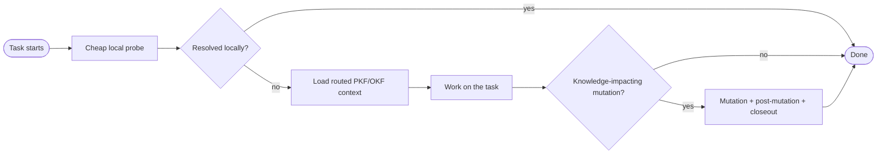
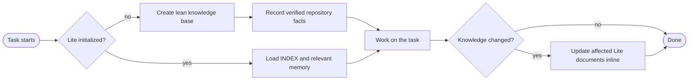

# Token Atlas

Token Atlas is a context-optimization skill for coding agents. It records
verified repository knowledge so an agent can load the smallest useful context
for a task instead of rediscovering the whole repository.

Token Atlas is model agnostic and agent agnostic. It does not require a
frontier model or a particular coding agent. A model such as gpt-5.6-luna at high
reasoning setting is more than sufficient to run the skill.

## Choose an edition

| Edition | What it is | Best for |
| --- | --- | --- |
| [Token Atlas](skills/token-atlas/) (Full) | A route-aware PKF/OKF knowledge base with adaptive retrieval and mutation closeout. | Large repositories, precise retrieval, and broad or cross-capability work. |
| [Token Atlas Lite](skills/token-atlas-lite/) | A lean, source-backed repository memory covering navigation, architecture, decisions, glossary, dependencies, and stable facts. | Normal day-to-day development. |

### Recommended: Token Atlas Lite

Lite is usually the better default. Its small PKF-style knowledge surface gives
agents useful repository context at a fraction of the token cost:

- Small startup context.
- Low maintenance overhead through inline updates.
- No separate mutation, post-mutation, or closeout lifecycle.
- Clear architecture, decisions, terminology, dependencies, and memory.
- Predictable, source-backed facts without route or leaf-generation overhead.

Lite does not provide Full's route-level retrieval, OKF leaves, retrieval
exports, or repository-local tools. Use Full when that extra precision and
retrieval speed are worth the additional cost.

### When to use Full

Full is optimized for retrieval. After initialization, its routed PKF/OKF
context is faster than `probe_only` for broad or cross-capability tasks.
Mutations require extra token-heavy work. The process includes mutation
analysis, post-mutation maintenance, and adaptive closeout. Use Full
selectively, because those steps can consume more tokens than the retrieval
itself.



## Quick start

### Lite

To make Lite appear in the skill list, copy the entire
`skills/token-atlas-lite/` folder into the project-local location for your
agent. Keep `SKILL.md` at the exact path shown below.

| Agent | Paste the Lite folder here |
| --- | --- |
| Claude Code | `<your-repo>/.claude/skills/token-atlas-lite/SKILL.md` |
| Codex CLI | `<your-repo>/.agents/skills/token-atlas-lite/SKILL.md` |
| Antigravity CLI (`agy`) | `<your-repo>/.agents/skills/token-atlas-lite/SKILL.md` |

For Claude Code, the copy command is:

```bash
mkdir -p <your-repo>/.claude/skills
cp -r skills/token-atlas-lite <your-repo>/.claude/skills/token-atlas-lite
```

For Codex CLI and Antigravity CLI (`agy`), use:

```bash
mkdir -p <your-repo>/.agents/skills
cp -r skills/token-atlas-lite <your-repo>/.agents/skills/token-atlas-lite
```

Then launch the agent from `<your-repo>` and ask:

> Use **token-atlas-lite** to initialize the lean knowledge base for this repository.

Lite creates six small Markdown files plus a manifest:

```text
.ai/
  token-atlas-lite.json
  INDEX.md
  ARCHITECTURE.md
  DECISIONS.md
  GLOSSARY.md
  DEPENDENCIES.md
  MEMORY.md
```

Later implementation tasks update only the affected Lite documents when new
facts are verified. Explicit refresh and validation are available when needed.



### Full

Copy the entire `skills/token-atlas/` folder to the same agent-specific paths
shown for Lite above. Replace `token-atlas-lite` with `token-atlas` in the
destination path and copy command.

Then ask your agent:

> Use the **token-atlas** skill to initialize PKF and extract knowledge for this repo.

Full creates a source-backed `.ai/` knowledge base with this load path:

```text
PKF.md → MEMORY.md → ARCHITECTURE.md → knowledge/INDEX.md
       → module indexes → task-required OKF leaves
```

## How it stays reliable

Both editions treat source code, tests, configuration, existing documentation,
and explicit user decisions as truth. They record evidence rather than
inventing implementation details. Full optimizes retrieval through routing and
deduplicated OKF leaves. Lite optimizes cost through a deliberately small,
human-readable knowledge base.

This repository maintains both public packages:

| Path | Purpose |
| --- | --- |
| `skills/token-atlas/` | Full Token Atlas package. |
| `skills/token-atlas-lite/` | Standalone Lite package. |
| `.agents/skills/token-atlas/` | Internal development and benchmark copy. |

> This is the skill-maintenance repository. Do not run Token Atlas against it.

## Development

The project uses [uv](https://docs.astral.sh/uv/) for development:

```bash
uv sync --locked
uv run python -m unittest tests.test_contract_consistency tests.test_two_tier_boundary tests.test_pkf_validate -v
```

Benchmarks are model-backed and can incur cost.

## License

Released under the terms in [LICENSE](LICENSE).
