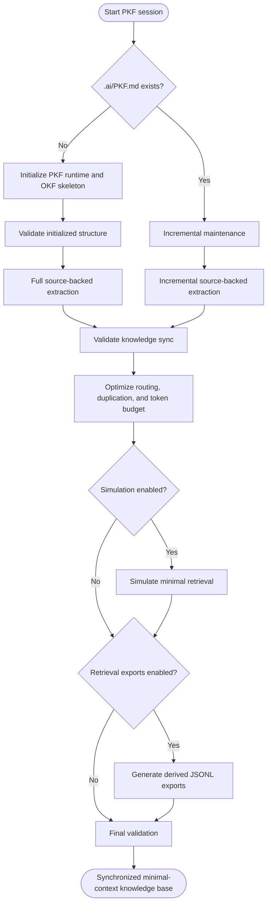

# token-atlas

Token Atlas is an AI context optimization framework that continuously extracts verified repository knowledge and generates an OKF-compatible knowledge base optimized for minimal-context retrieval by AI coding agents.

It treats repository source as truth, `.ai/` Markdown as canonical AI knowledge, and optional retrieval exports as derived artifacts.

## PKF Lifecycle



Lifecycle phases:

| Phase | Purpose | Output |
|-------|---------|--------|
| Initialize | Create `.ai/PKF.md`, runtime docs, root index, shared docs, and module skeletons. | Empty OKF-compatible structure. |
| Maintain | Detect changed, renamed, and deleted files. | Affected modules, docs, stale references, and duplicate facts. |
| Extract | Add only source-backed facts to the narrowest authoritative document. | Current canonical `.ai/` Markdown. |
| Optimize | Tighten routing, remove duplication, and keep automatic loads small. | Minimal `pkf.loads`, useful `pkf.related`, token impact report. |
| Simulate | Predict context for a task intent or changed paths. | Selected modules, required docs, optional docs, token estimate, warnings. |
| Validate | Check structure, metadata, sync, stale evidence, routing, simulation, tooling, and token budget. | Passed, Warnings, Errors, and Token Impact. |
| Export | Generate optional RAG or GraphRAG JSONL from canonical Markdown. | Derived `.ai/retrieval/` files only when enabled. |
| Benchmark | Run fixture-based skill evals. | Fixture reports, aggregate score, token regressions, and routing failures. |

## Startup Recovery

At the beginning of a PKF session, read `.ai/PKF.md`. If it is missing, run initialization before repository analysis. Initialization creates the runtime contract that routes agents through `MEMORY.md`, `ARCHITECTURE.md`, and `knowledge/INDEX.md`.

Missing `.ai/PKF.md` is a CI blocking startup error. Advisory workflows should report the recovery step without treating the default workflow as a CI failure.

## Execution Profiles

Default profile is `core`: initialize or maintain, extract, optimize, and run lightweight validation.

| Profile | Use when | Defaults |
|---------|----------|----------|
| `core` | Normal local maintenance. | `retrieval_exports: off`, `simulation: changed`, `token_budget: summary`, `validation_strictness: advisory` |
| `ci` | PR or release validation. | `simulation: required`, `token_budget: full`, `validation_strictness: ci` |
| `retrieval` | Generating RAG or graph exports on request. | Core defaults unless `retrieval_exports` is set. |
| `full` | Exhaustive validation and export generation. | `retrieval_exports: all`, `simulation: all`, `token_budget: full`, `validation_strictness: ci` |

Shared options:

| Option | Values | Default |
|--------|--------|---------|
| `retrieval_exports` | `off`, `rag`, `graph`, `all` | `off` |
| `simulation` | `off`, `changed`, `required`, `all` | `changed` |
| `token_budget` | `summary`, `full` | `summary` |
| `validation_strictness` | `advisory`, `ci` | `advisory` |

## Retrieval Optimization

Token Atlas optimizes for the smallest predictable context set that can safely handle a task. The standard load path is:

```text
PKF.md -> MEMORY.md -> ARCHITECTURE.md -> knowledge/INDEX.md -> knowledge/<module>/INDEX.md -> required leaf docs
```

| Layer | Keep | Avoid |
|-------|------|-------|
| `PKF.md` | Startup sequence, execution rules, validation gates. | Repository implementation details. |
| `MEMORY.md` | Stable facts that apply across most tasks. | Module-specific behavior. |
| `ARCHITECTURE.md` | Path ownership, source roots, module map. | API, schema, or business-rule facts. |
| `knowledge/INDEX.md` | Root routing by task, keyword, module, and path. | Leaf knowledge copied from modules. |
| Module `INDEX.md` | Module purpose, task routing, document map. | Long explanations better kept in leaf docs. |
| Leaf docs | Source-backed facts for one knowledge type. | Repeated facts from other documents. |

Use `pkf.loads` only for context required automatically for a task. Use `pkf.related` for useful optional context when the task expands.

Default token thresholds:

| Route | Threshold | Result |
|-------|-----------|--------|
| Startup path | Above 4,000 estimated tokens | Warning |
| Module task | Above 8,000 estimated tokens | Warning |
| Unrelated automatic module load | Any occurrence | Error |

Use an exact tokenizer when available. Otherwise use `ceil(character_count / 4)` and mark the estimate approximate.

## Incremental Maintenance

`maintenance.md` defines the default core workflow for synchronizing PKF after repository changes.

Change detection order:

1. `git diff --cached --name-status`
2. `git diff --name-status`
3. Full repository scan fallback

Maintenance maps changed paths to affected modules and canonical docs, invalidates facts that cite deleted or renamed evidence, reports duplicate authoritative facts, and regenerates retrieval exports only when `retrieval_exports` is enabled.

## Retrieval Simulation

`simulate.md` predicts the smallest OKF context set for a natural-language task intent and optional changed paths.

Simulation reports include selected modules, required docs, optional related docs, token cost, estimator type, routing evidence, warnings, and errors. Default `changed` mode only simulates the current task intent or changed paths. `required` and `all` modes cover representative API, schema, business logic, UI, architecture, and tooling scenarios.

Unrelated modules loaded automatically through `pkf.loads` are validation defects.

## Validation Report

Validation reports use four sections:

- Passed: checks that succeeded.
- Warnings: non-blocking issues with recommendations and retrieval impact.
- Errors: blocking issues with evidence and recommended fixes.
- Token Impact: startup and task retrieval costs, including broad `pkf.loads` chains.

CI strictness exits nonzero for blocking validation failures. Advisory strictness reports the same issues as recommendations.

## Optional Retrieval Exports

`export.md` defines backend-neutral generated artifacts under `.ai/retrieval/`.

| `retrieval_exports` | Generated files |
|---------------------|-----------------|
| `off` | none |
| `rag` | `documents.jsonl`, `claims.jsonl` |
| `graph` | `entities.jsonl`, `relationships.jsonl`, `claims.jsonl` |
| `all` | `documents.jsonl`, `entities.jsonl`, `relationships.jsonl`, `claims.jsonl` |

Exports are generated from canonical `.ai/` Markdown and cited source evidence. They may feed vector RAG, GraphRAG, or custom retrieval tooling, but they are never loaded in the PKF startup path and never become source truth.

## Benchmarks

`benchmark.md` defines fixture-based skill evals. Benchmarks score startup recovery, initialization, extraction, maintenance, validation, simulation, optimization, exports, and wrapper behavior.

| Suite | Use when |
|-------|----------|
| `quick` | Fast local confidence for startup and simple routing. |
| `core` | Normal development checks across the main skill behaviors. |
| `full` | Release or CI checks, including retrieval exports. |

Benchmarks run against isolated fixture repositories under `.agents/skills/token-atlas/benchmarks/fixtures/`. Do not run Token Atlas against this skill-maintenance repository itself.

Executable benchmark harness:

```powershell
python scripts\pkf_bench.py --suite quick --mode local
python scripts\pkf_bench.py --suite full --mode both --format json --report .\token-atlas-bench-full.json
```

The runner pins benchmark model defaults instead of inheriting ambient Codex config:

```text
--model gpt-5.5 --model-reasoning-effort medium
```

Every benchmark report records the resolved model, reasoning effort, and whether each came from a runner default or CLI flag.

Runner modes:

| Mode | Purpose |
|------|---------|
| `local` | Fast deterministic fixture, patch, `.ai`, and routing contract checks. |
| `codex` | Runs `codex exec` inside isolated fixture workspaces and scores the structured report. |
| `both` | Runs local and Codex checks; a fixture fails if either mode fails. |

Full Codex-backed runs can be slow and may incur model cost. Prefer `local` or quick/core suites for routine CI, and reserve full Codex runs for manual, release, or nightly checks.

## Two-Tier Skill Layout

This repository keeps two Token Atlas skill surfaces:

| Path | Purpose |
|------|---------|
| `.agents/skills/token-atlas/` | Internal development copy used to maintain and benchmark Token Atlas itself. |
| `skills/token-atlas/` | Public standalone skill package for installation or copying into other projects. |

The public package is intentionally activation-light. It provides `SKILL.md` plus workflow references, but no daemon, watcher, global hook, benchmark fixtures, or repo-local wrapper script. Use it when a target repository explicitly wants PKF/OKF initialization, maintenance, extraction, optimization, validation, simulation, or exports.

## Developer Tooling

`scripts/pkf.ps1` is a thin workflow wrapper. It selects documented PKF workflows and options; it does not implement extraction, optimization, validation, simulation, benchmark scoring, or export logic.

Start with help:

```powershell
powershell -NoProfile -ExecutionPolicy Bypass -File scripts\pkf.ps1 --help
```

Common commands:

| Goal | Command |
|------|---------|
| Show help | `powershell -NoProfile -ExecutionPolicy Bypass -File scripts\pkf.ps1 --help` |
| Initialize PKF | `powershell -NoProfile -ExecutionPolicy Bypass -File scripts\pkf.ps1 init` |
| Maintain changed knowledge | `powershell -NoProfile -ExecutionPolicy Bypass -File scripts\pkf.ps1 maintain` |
| Validate advisory mode | `powershell -NoProfile -ExecutionPolicy Bypass -File scripts\pkf.ps1 validate` |
| Validate CI mode | `powershell -NoProfile -ExecutionPolicy Bypass -File scripts\pkf.ps1 validate -Ci` |
| Simulate retrieval | `powershell -NoProfile -ExecutionPolicy Bypass -File scripts\pkf.ps1 simulate -Intent "change an API route" -Paths src/routes.ts` |
| Export retrieval graph | `powershell -NoProfile -ExecutionPolicy Bypass -File scripts\pkf.ps1 export -RetrievalExports graph` |
| Benchmark quick suite | `powershell -NoProfile -ExecutionPolicy Bypass -File scripts\pkf.ps1 bench` |
| Benchmark full JSON suite | `powershell -NoProfile -ExecutionPolicy Bypass -File scripts\pkf.ps1 bench -BenchSuite full -BenchOutput json` |
| Run local benchmark | `python scripts\pkf_bench.py --suite quick --mode local` |
| Run full hybrid benchmark | `python scripts\pkf_bench.py --suite full --mode both --format json` |
| Run full hybrid benchmark with explicit model | `python scripts\pkf_bench.py --suite full --mode both --model gpt-5.5 --model-reasoning-effort medium` |

The wrapper supports PowerShell parameters and common kebab-case aliases:

```powershell
powershell -NoProfile -ExecutionPolicy Bypass -File scripts\pkf.ps1 export --retrieval-exports graph
powershell -NoProfile -ExecutionPolicy Bypass -File scripts\pkf.ps1 validate --ci
powershell -NoProfile -ExecutionPolicy Bypass -File scripts\pkf.ps1 validate --help
powershell -NoProfile -ExecutionPolicy Bypass -File scripts\pkf.ps1 bench --bench-suite core
powershell -NoProfile -ExecutionPolicy Bypass -File scripts\pkf.ps1 bench --bench-suite full --bench-output json
```

Codex skill usage and local wrapper usage are separate surfaces. In Codex, ask for the `token-atlas` skill by name and state options in natural language, such as `profile=ci` or `retrieval_exports=off`.

